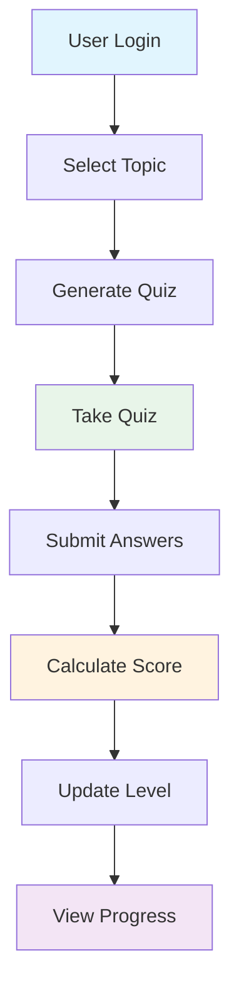

# SmartLearn - AI-Powered Quiz Generator

An interactive web application that generates quizzes on any topic using OpenAI's GPT-3.5 Turbo, provides instant feedback, and recommends learning resources based on performance.

## System Architecture




## Features

- **Dynamic Quiz Generation**: Create quizzes on any topic using AI
- **Multiple Choice Format**: Each quiz includes multiple-choice questions with four options
- **Instant Feedback**: Get immediate results after quiz submission
- **Performance Analysis**: 
  - Score calculation
  - Proficiency level assessment (Beginner/Intermediate/Expert)
  - Detailed feedback for each question
- **Learning Resources**: Personalized YouTube tutorial recommendations based on proficiency level
- **User-Friendly Interface**: Clean, responsive design using Bootstrap

  ## Prerequisites
  # - Python 3.x: This project was developed and tested using Python 3.x.
  # - OpenAI API key: This project uses OpenAI's GPT-3.5 model to generate quizzes.

## Prerequisites

- Python 3.x
- OpenAI API key

## Installation

1. Clone the repository:
   ```bash
   git clone <repository-url>
   cd PythonProject4
   ```

2. Install required packages:
   ```bash
   pip install -r requirements.txt
   ```

3. Create a `.env` file in the project root and add your OpenAI API key:
   ```
   OPENAI_API_KEY=your_api_key_here
   ```

## Usage

1. Start the Flask server:
   ```bash
   python app.py
   ```

2. Open your web browser and navigate to:
   ```
   http://localhost:5006
   ```

3. Enter any topic you'd like to be quizzed on and click "Generate Quiz"

## User Classification

The application uses a Gradient Boosting Classifier to determine user proficiency levels based on multiple performance metrics:

### Features Used
- Average quiz score
- Number of quizzes taken
- Hint usage patterns
- Retry attempts

### Proficiency Levels
- **Advanced**: Demonstrates mastery of topics
- **Intermediate**: Shows good understanding with room for improvement
- **Beginner**: Recommended to start with basic tutorials

### Model Performance
- **Accuracy**: 100% on test set
- **Cross-validation Score**: 97.9% (±2.6%)
- **Feature Scaling**: StandardScaler for consistent predictions

### Fallback Classification
If the ML model is unavailable, the system falls back to a simple score-based classification:
- **Advanced** (≥80%): Advanced understanding
- **Intermediate** (50-79%): Good foundation
- **Beginner** (<50%): Needs fundamental review

## Technical Stack

- **Backend**: Flask (Python)
- **Frontend**: HTML, Bootstrap 5
- **AI Integration**: OpenAI GPT-3.5 Turbo
- **Machine Learning**: scikit-learn (Gradient Boosting Classifier)
- **Data Processing**: pandas, numpy
- **Session Management**: Flask-Session
- **Environment Management**: python-dotenv

## File Structure

- `app.py`: Main Flask application and route handlers
- `quiz_generator.py`: OpenAI integration and quiz generation logic
- `user_performance_classifier.py`: ML model training and prediction
- `templates/`: HTML templates
  - `quiz.html`: Quiz interface
  - `results.html`: Results and recommendations page
- `requirements.txt`: Project dependencies
- `.env`: Environment variables (API keys)
- `user_level_classifier.joblib`: Trained ML model
- `user_level_scaler.joblib`: Feature scaler for ML input


